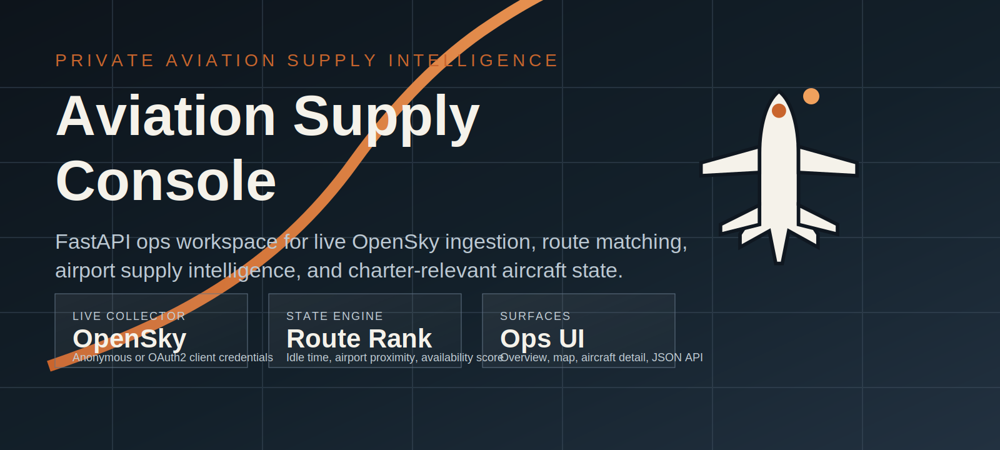
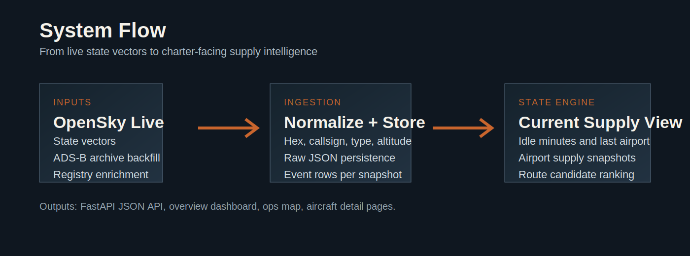

<p align="center">
  
</p>

<h1 align="center">Aviation Supply Console</h1>

<p align="center">
  <strong>Real-time aircraft intelligence for private aviation operations.</strong>
</p>

<p align="center">
  <a href="https://www.python.org/downloads/"></a>
  <a href="https://fastapi.tiangolo.com"></a>
  <a href="https://www.sqlalchemy.org"></a>
  <a href="https://docs.astral.sh/ruff/"></a>
  <a href="https://github.com/astral-sh/uv"></a>
  <a href="https://pydantic.dev"></a>
</p>

<br>

<p align="center">
  
</p>

---

Live OpenSky ingestion &bull; ADS-B Exchange archive replay &bull; Charter-relevant aircraft classification &bull; Multi-factor availability scoring &bull; Route candidate ranking &bull; Airport supply snapshots &bull; FastAPI ops console

---

## Table of Contents

- [Overview](#overview)
- [Features](#features)
- [Architecture](#architecture)
- [Quick Start](#quick-start)
- [Live Collection](#live-collection)
- [API Reference](#api-reference)
- [Configuration](#configuration)
- [Development](#development)
- [Deployment](#deployment)
- [Project Structure](#project-structure)
- [Contributing](#contributing)

## Overview

Aviation Supply Console is a production-shaped internal ops workspace for private aviation marketplaces, charter brokers, and supply intelligence teams.

It ingests real aircraft state data from [OpenSky Network](https://opensky-network.org/) and [ADS-B Exchange](https://www.adsbexchange.com/), normalizes and classifies the fleet for charter relevance, computes live aircraft state with availability scoring, and exposes everything through dashboards, maps, and APIs.

### Ops Surfaces

| Surface | Description |
| --- | --- |
| **Overview** | Collector readiness, latest snapshot coverage, top aircraft, airport supply |
| **Ops Map** | Real-time charter-relevant aircraft positions with airport anchor overlays |
| **Aircraft Detail** | Single-aircraft state, position history, and airport visit timeline |
| **Route Candidates** | Rank available aircraft for origin &rarr; destination pairs (e.g. `TEB` &rarr; `OPF`) |

## Features

<table>
<tr><td width="50%" valign="top">

### Data Ingestion
- Live **OpenSky** polling &mdash; anonymous or OAuth2
- **ADS-B Exchange** archive replay for historical validation
- **Registry enrichment** with ICAO types, manufacturers, operators
- **Pluggable collector** &mdash; swap in any licensed feed

</td><td width="50%" valign="top">

### Aircraft Intelligence
- Charter-relevant classification across **5 aircraft classes**
- Multi-factor **availability scoring** (idle time, proximity, activity)
- **Availability bands** (high / medium / low) for quick triage
- **24h and 72h** activity tracking per aircraft

</td></tr>
</table>

### Data Sources

| Source | Role | Notes |
| --- | --- | --- |
| OpenSky `/states/all` | Live state vectors | Anonymous or OAuth2. US bounding box by default. |
| ADS-B Exchange `readsb-hist` | Historical replay | Public samples available on the 1st of each month. |
| `basic-ac-db.json.gz` | Registry enrichment | Registrations, ICAO types, manufacturers, operators. |

### Aircraft Classes

> Light jets &bull; Midsize jets &bull; Heavy jets &bull; Turboprops &bull; Rotorcraft

Charter-irrelevant types (airliners, pistons, military, unclassified) are automatically filtered out.

## Architecture

<p align="center">
  
</p>

```
OpenSky / Custom Feed
    |
    v
Fetch --> Decompress --> Persist Raw JSON
    |
    v
Parse --> Classify Aircraft --> Resolve Nearest Airport
    |
    v
PositionEvent (append-only)  +  Upsert AircraftMaster
    |
    v
State Engine: idle time, activity windows, availability score
    |
    v
AircraftStateCurrent  +  AirportSupplySnapshot
    |
    v
FastAPI --> JSON APIs  +  Jinja2 HTML Surfaces
```

## Quick Start

### Prerequisites

- **Python 3.12+**
- [**uv**](https://github.com/astral-sh/uv) package manager

### Install and run

```bash
git clone https://github.com/your-org/aviation-supply-console.git
cd aviation-supply-console

# Set up environment
uv venv && source .venv/bin/activate
uv sync

# Initialize database
uv run aviation-console init-db

# Load aircraft registry
uv run aviation-console import-registry

# Import a historical snapshot
uv run aviation-console import-snapshot --when 2026-03-01T00:00:00Z

# Start the web app
uv run uvicorn aviation_supply_console.app:create_app --factory --reload
```

> [!TIP]
> Optionally backfill a wider window for richer state data:
> ```bash
> uv run aviation-console backfill-window \
>   --start 2026-03-01T00:00:00Z \
>   --minutes 30 \
>   --step-seconds 300
> ```

Then open:

| URL | Surface |
| --- | --- |
| [`http://127.0.0.1:8000`](http://127.0.0.1:8000) | Overview dashboard |
| [`http://127.0.0.1:8000/map`](http://127.0.0.1:8000/map) | Ops map |
| [`http://127.0.0.1:8000/aircraft/<hex>`](http://127.0.0.1:8000/aircraft/) | Aircraft detail |

## Live Collection

Default: OpenSky with a US bounding box at a **5-minute** polling cadence.

```bash
# Single poll cycle
uv run aviation-console poll-live --cycles 1
```

<details>
<summary><strong>Authenticated OpenSky (higher rate limits)</strong></summary>

```bash
export AVIATION_OPENSKY_CLIENT_ID="your-client-id"
export AVIATION_OPENSKY_CLIENT_SECRET="your-client-secret"
```

</details>

<details>
<summary><strong>Custom bounding box</strong></summary>

```bash
export AVIATION_OPENSKY_LAMIN="24.0"
export AVIATION_OPENSKY_LOMIN="-126.0"
export AVIATION_OPENSKY_LAMAX="50.0"
export AVIATION_OPENSKY_LOMAX="-66.0"
```

</details>

<details>
<summary><strong>Custom licensed feed</strong></summary>

```bash
export AVIATION_LIVE_PROVIDER="custom"
export AVIATION_LIVE_SNAPSHOT_URL="https://your-feed.example.com/aircraft"
export AVIATION_LIVE_AUTH_HEADER_NAME="api-auth"
export AVIATION_LIVE_AUTH_TOKEN="replace-me"
```

</details>

## API Reference

| Method | Endpoint | Description |
| --- | --- | --- |
| `GET` | `/api/health` | Service health check |
| `GET` | `/api/ops/summary` | Dashboard summary &mdash; top aircraft, airports, collector status |
| `GET` | `/api/collector/status` | Live provider readiness and configuration |
| `GET` | `/api/aircraft/{hex_code}` | Current state of a single aircraft |
| `GET` | `/api/aircraft/{hex_code}/history` | Recent positions and airport visits |
| `GET` | `/api/airports/{icao}/supply` | Aircraft currently at a specific airport |
| `GET` | `/api/map/aircraft` | Map view data with positions and airport anchors |
| `GET` | `/api/routes/candidates?origin=TEB&destination=OPF` | Route matching with availability scoring |

## Configuration

All settings via environment variables. Sensible defaults work out of the box.

<details>
<summary><strong>Database & Storage</strong></summary>

| Variable | Default | Description |
| --- | --- | --- |
| `AVIATION_DATABASE_URL` | `sqlite:///./data/aviation_supply.db` | SQLAlchemy connection string |
| `AVIATION_RAW_DATA_DIR` | `./data/raw` | Local cache for raw imports |

</details>

<details>
<summary><strong>OpenSky Provider</strong></summary>

| Variable | Default | Description |
| --- | --- | --- |
| `AVIATION_LIVE_PROVIDER` | `opensky` | `opensky` or `custom` |
| `AVIATION_LIVE_POLL_INTERVAL_SECONDS` | `300` | Poll cadence in seconds |
| `AVIATION_OPENSKY_CLIENT_ID` | &mdash; | OAuth2 client ID (optional) |
| `AVIATION_OPENSKY_CLIENT_SECRET` | &mdash; | OAuth2 client secret |
| `AVIATION_OPENSKY_EXTENDED` | `true` | Request extended attributes |

</details>

<details>
<summary><strong>Custom Provider</strong></summary>

| Variable | Default | Description |
| --- | --- | --- |
| `AVIATION_LIVE_SNAPSHOT_URL` | &mdash; | Feed endpoint URL |
| `AVIATION_LIVE_AUTH_HEADER_NAME` | &mdash; | Auth header key |
| `AVIATION_LIVE_AUTH_TOKEN` | &mdash; | Auth token value |

</details>

<details>
<summary><strong>Matching & Scoring</strong></summary>

| Variable | Default | Description |
| --- | --- | --- |
| `AVIATION_DEFAULT_AIRPORT_COUNTRY` | `US` | Airport filter by country |
| `AVIATION_AIRPORT_MATCH_RADIUS_NM` | `20` | Airport proximity threshold (nm) |
| `AVIATION_ROUTE_SEARCH_RADIUS_NM` | `250` | Route candidate search radius (nm) |
| `AVIATION_API_TIMEOUT_SECONDS` | `60` | HTTP request timeout |

</details>

## Development

```bash
# Install with dev dependencies
uv sync --all-extras

# Run tests
uv run pytest

# Lint and format
uv run ruff check .
uv run ruff format .
```

## Deployment

Optimized for a persistent Python host, not serverless.

| Component | Local Default | Production |
| --- | --- | --- |
| Database | SQLite | PostgreSQL |
| Raw storage | `data/` directory | S3 / GCS object storage |
| Live collector | CLI poller | Scheduled job / background worker |
| Web server | Uvicorn (dev) | Gunicorn + Uvicorn workers |

## Project Structure

```
src/aviation_supply_console/
├── app.py                  # FastAPI application factory
├── cli.py                  # Typer CLI (init-db, import-*, poll-live, backfill)
├── api/
│   ├── routes.py           # HTTP routes — HTML pages + JSON endpoints
│   └── schemas.py          # Pydantic response models
├── core/
│   └── config.py           # Environment-based settings
├── db/
│   └── base.py             # SQLAlchemy engine + session factory
├── models/
│   └── entities.py         # ORM models (5 tables)
├── services/
│   ├── ingestion.py        # OpenSky + ADS-B Exchange import adapters
│   ├── state_engine.py     # Availability scoring + supply rollups
│   ├── classification.py   # Charter-relevant aircraft filtering
│   ├── airports.py         # Airport matching + haversine distance
│   └── http.py             # HTTP fetch + decompression utilities
├── static/                 # CSS + favicon
└── templates/              # Jinja2 HTML (overview, map, aircraft detail)
```

## Contributing

Contributions are welcome! Please open an issue first to discuss what you'd like to change.

1. Fork the repository
2. Create a feature branch (`git checkout -b feature/your-feature`)
3. Run tests and linting before committing
4. Open a pull request
